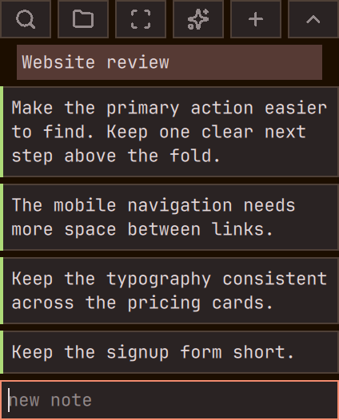

# Omatate

A floating notes panel for Omarchy Quattro. Keep notes beside a mockup, website,
or application, group them into sections, and attach screen clips.



- Write, edit, and search notes without switching away from your work.
- Capture a screen rectangle and attach it to a note.
- Dictate with an optional push-to-talk binding.
- Add AI screen descriptions when dictating, off by default.

Each project is a folder you choose. Notes are readable as `notes.md`, with
records under `.data/` and screen clips under `assets/`.

## Install

With Omarchy Quattro and its Quickshell shell running:

```sh
omarchy plugin add https://github.com/cordrogue/omatate.git --enable
```

Open Omatate from the shell's plugin controls, or run its command directly:

```sh
~/.config/omarchy/plugins/cordrogue.omatate/bin/omatate open
```

For a shorter command in your terminal, add this alias to your shell config:

```sh
alias omatate="$HOME/.config/omarchy/plugins/cordrogue.omatate/bin/omatate"
```

Omatate runs in Quickshell using QML and JavaScript. There is no compilation or
setup script. Its command launcher uses Bash, `jq`, and `omarchy-shell`.
Filesystem operations use coreutils, findutils, and `flock` available on Omarchy.

Optional features need these tools available on your PATH:

| Feature | Tools |
| --- | --- |
| Screen clips | `grim`, `slurp` |
| Dictation | `voxtype`, configured for your microphone |
| AI descriptions | `grim`, `hyprctl`, an authenticated `codex` CLI |

Typing notes works without any of these optional tools.

## Use

Open a project folder from the panel, create a new folder, or run:

```sh
omatate open-project /path/to/project
```

`omatate open` restores the last project or shows the project selector. Drafts
and edits save after a short typing pause. Pending edits save before switching
projects or closing the panel.

| Action | Shortcut |
| --- | --- |
| Save a new note | Ctrl+Return or Ctrl+S |
| Delete the focused note | Ctrl+Delete |
| Search notes and descriptions | Ctrl+F |
| Show projects | Ctrl+P |
| Add a section | Ctrl+Shift+S |
| Capture a screen clip | Ctrl+Shift+C |
| Expand the focused note | Alt+Shift+Return |
| Cycle panel opacity | Ctrl+Shift+O |
| Show help | Ctrl+H or F1 |

`omatate clip` opens the rectangle picker. Escape cancels. A captured image is
saved inside the project and linked from `notes.md`. Deleting a note preserves
its image file.

`omatate stop` saves and ends the session. `omatate help` lists all commands.
The plugin must be enabled and the shell running for its commands to work.

### Global keybindings

Add these to your Hyprland Lua configuration. The command uses its full path,
so terminal aliases are not needed for keybindings.

```lua
local omatate = os.getenv("HOME") .. "/.config/omarchy/plugins/cordrogue.omatate/bin/omatate"
hl.layer_rule({ match = { namespace = "omatate" }, no_anim = true, animation = "none" })
o.bind("SUPER + SHIFT + U", "Omatate session", omatate .. " toggle")
o.bind("SUPER + U", "Omatate keyboard focus", omatate .. " focus-toggle")
o.bind("HOME", "Start dictation", omatate .. " ptt start")
o.bind("HOME", "Stop dictation", omatate .. " ptt stop", { release = true })
```

Super+U moves keyboard focus between Omatate and the previous application.
The mouse can also transfer focus while notes remain visible.

Skip the HOME bindings if you do not use dictation. With them, HOME dictates
into Omatate when its new-note editor has focus and uses ordinary Voxtype
output elsewhere. Finish recording and transcription before changing projects.

## Appearance and shortcuts

Colors and typography follow Ghostty's effective configuration when available,
with the Omarchy theme and font as fallbacks. The panel watches its theme files
for changes. Opacity cycles through 100%, 80%, 60%, and 40% for the current
plugin session.

Copy [share/keys.toml](share/keys.toml) to
`$XDG_CONFIG_HOME/omatate/keys.toml`, or `~/.config/omatate/keys.toml` when that
variable is unset. Keep only the actions you want to override. An empty array
disables a shortcut. Invalid or conflicting shortcuts fall back to the defaults.

## Privacy and files

The plugin runs as your user inside the shared Omarchy shell. It writes only
project notes, its own preferences and project list, and temporary runtime
files. It does not modify desktop configuration or install a system service.

Screen clips capture only the rectangle you select. Dictation runs
`voxtype record start` and `voxtype record stop`; Voxtype controls the
microphone and transcription. Whether audio stays local depends on your
Voxtype configuration.

AI analysis is off by default. Enable it with `omatate ai on` and disable it
with `omatate ai off`. When enabled, pressing push-to-talk in the new-note
editor captures the entire focused monitor with the panel hidden. It passes
that screenshot to `codex exec` in read-only sandbox mode, with the project
folder as the working directory. The agent can read files in that folder,
and the screenshot includes anything visible in other windows on that monitor.
It uses the account configured for your Codex CLI.

AI screenshots are temporary and do not become project assets. They are
removed about five minutes after capture. Analysis and
transcription results are associated with the project and note that started
them. Finish analysis before relocating a project.

`OMATATE_MODEL` and `OMATATE_REASONING`, set in the shell's environment, override
the analysis model and reasoning effort. Defaults are `gpt-5.6-sol` and `low`.

| Location | Contents |
| --- | --- |
| `<project>/notes.md` | Readable Markdown generated from the records |
| `<project>/.data/` | Note records, draft, transcripts, analysis results and logs |
| `<project>/assets/` | Screen clips |
| `~/.config/omatate/ai` | Explicit AI opt-in |
| `$XDG_CONFIG_HOME/omatate/keys.toml` | Shortcut overrides |
| `$XDG_STATE_HOME/omatate/projects.json` | Known projects |
| `$XDG_RUNTIME_DIR/omatate/` | Active project pointer and temporary work files |

Unset config and state directories default to `~/.config` and `~/.local/state`.
Keep `.data/` with `notes.md` when moving or backing up a project. Edit notes in
the panel; edits made directly to generated Markdown are replaced on the next
save or render. Project folders and their contents are preserved when a session
ends or the plugin is removed.

## Update and remove

```sh
omarchy plugin update cordrogue.omatate
```

To remove Omatate, finish dictation and analysis, save and close the panel,
then run:

```sh
omarchy plugin remove cordrogue.omatate
```

Remove any Omatate aliases or keybindings you added. Project files and
preferences remain yours to keep or delete.

## Development

See [docs/testing.md](docs/testing.md) for storage, command, QML component, and
Quickshell integration checks. [CONTRACT.md](CONTRACT.md) describes the file
format and service behavior.

MIT licensed. Icon attribution is in [qml/icons/README.md](qml/icons/README.md).
